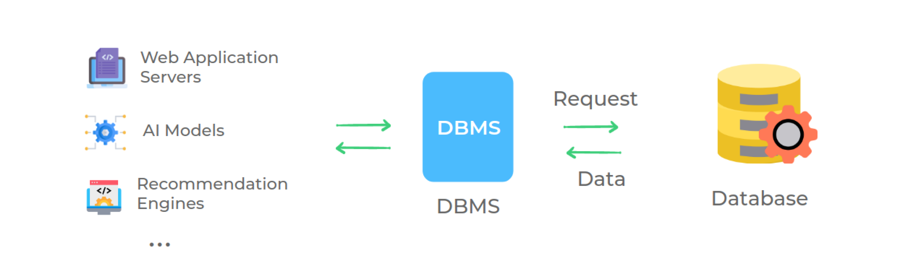
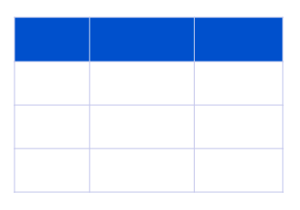
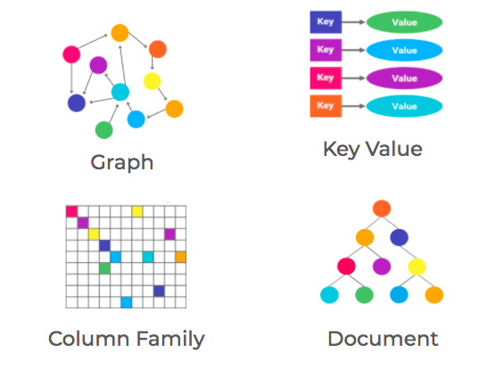
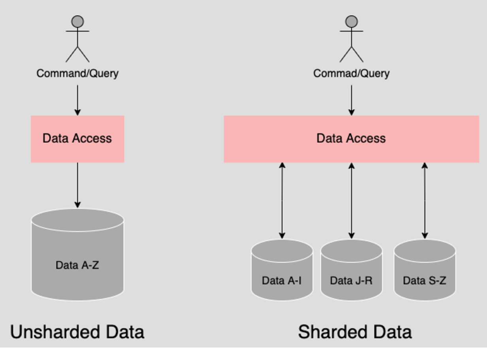

# Database

<details>
<summary>Index</summary>

## Index

- Introduction
- SQL Commands
- Scaling
</details>

---

<details>
<summary>Introduction</summary>

## Introduction

### Data

Any information that is stored is called data.

**Examples**:

- **Messages** on WhatsApp
- **Products and orders** on Amazon
- **Contact details** in telephone directory

### Database

A database is an organized collection of data for easy access and updating.

### DBMS

- **DBMS** stands for **Database Management System**
- A software that is used to easily **store** and **access** data from the database in a secure way.



### Types of Databases

1. Relational Database
2. Non-Relational Database

### Relational Database

- **RDBMS** stands for **Relational DBMS**
- A relational DBMS is a DBMS designed specially for relational database.
- Relational databases organize the data in the form of tables.

**Examples** :  
`SQLite`, `PostgreSQL`



### Non-Relational Database

- A Non-relational DBMS is a DBMS designed specially for non-relational databases.
- Non-relational databases store the data in a non-tabular form.

Example:  
`MongoDB`, `Redis`



</details>

---

<details>
<summary>SQL Commands</summary>

## SQL Commands

**SQL** stands for **Structured Query Language**

1. DDL (Data Definition Language)
2. DML (Data Manipulation Language)
3. DQL (Data Query Language)

### 1. DDL

- **DDL** stands for **Data Definition Language**
- DDL commands used to define and manage the structure of database objects like tables, indexes, and schemas.
- DDL commands create, modify, and delete database structures but do not work directly with data
- Example : `CREATE`, `ALTER`, `DROP`
  - CREATE: Used to create new database objects, like tables and indexes.
  - ALTER: Modifies the structure of an existing object, for example, by adding or removing columns in a table.
  - DROP: Deletes an entire database object, like a table, index, or schema.

### 2. DML

- DML stands for Data Manipulation Language
- DML is used to insert, update, and delete data in database tables.
- Example : `INSERT`, `UPDATE`, `DELETE`
  - INSERT: Adds new records to a table.
  - UPDATE: Modifies existing data in a table.
  - DELETE: Removes records from a table.

### 3. DQL

- **DQL** stands for **Data Query Language**
- DQL is used to retrieve data from the database.
- DQL is used to query the database and return requested data, often with specific filters, sorting, and grouping.
- Example : `SELECT`
  - SELECT: Fetches data from a database table.
  - Additional Features:
    - WHERE clause to filter records.
    - ORDER BY to sort results.
    - GROUP BY to group results based on a column.

</details>

---

<details>
<summary>Scaling</summary>

## Scaling

1. Horizontal Scaling (Database Sharding)
2. Vertical Scaling

### Horizontal Scaling

- Horizontal scaling is nothing but Database Sharding.
- Database sharding is the process of storing a large database across multiple machines. A single machine, or database server, can store and process only a limited amount of data. Database sharding overcomes this limitation by splitting data into smaller chunks, called shards, and storing them across several database servers. All database servers usually have the same underlying technologies, and they work together to store and process large volumes of data.
- As an application grows, the number of application users and the amount of data it stores increase over time. The database becomes a bottleneck if the data volume becomes too large and too many users attempt to use the application to read or save information simultaneously. The application slows down and affects customer experience. Database sharding is one of the methods to solve this problem because it enables parallel processing of smaller datasets across shards.
- Data retrieval takes longer on a single large database. The database management system needs to search through many rows to retrieve the correct data. By contrast, data shards have fewer rows than the entire database. Therefore, it takes less time to retrieve specific information, or run a query, from a sharded database.

#### How Database Sharding Works ?

A database stores information in multiple datasets consisting of columns and rows. Database sharding splits a single dataset into partitions or shards. Each shard contains unique rows of information that you can store separately across multiple computers, called nodes. All shards run on separate nodes but share the original database’s schema or design.

For example, an unsharded database containing a dataset for customer records might look like this.

```table
CustomerID    Name     State

1           John       California

2         Jane         Washington

3         Paulo        Arizona

4        Wang          Georgia
```

Sharding involves separating different rows of information from the table and storing them on different machines, as the following shows.

Computer A

```
CustomerID    Name       State

1             John       California

2            Jane        Washington
```

Computer B

```
CustomerID       Name       State

3               Paulo       Arizona

4              Wang          Georgia
```

#### Shards

The partitioned data chunks are called logical shards. The machine that stores the logical shard is called a physical shard or database node. A physical shard can contain multiple logical shards.

#### Shard key

Software developers use a shard key to determine how to partition the dataset. A column in the dataset determines which rows of data group together to form a shard. Database designers choose a shard key from an existing column or create a new one.

#### Shared-nothing architecture

Database sharding operates on a shared-nothing architecture. Each physical shard operates independently and is unaware of other shards. Only the physical shards that contain the data that you request will process the data in parallel for you.

A software layer coordinates data storage and access from these multiple shards. For example, some types of database technology have automatic sharding features built in. Software developers can also write sharding code in their application to store or retrieve information from the correct shard or shards.



### Vertical Scaling

Vertical scaling increases the computing power of a single machine. For example, the IT team adds a CPU, RAM, and a hard disk to a database server to handle increasing traffic.


</details>

---
